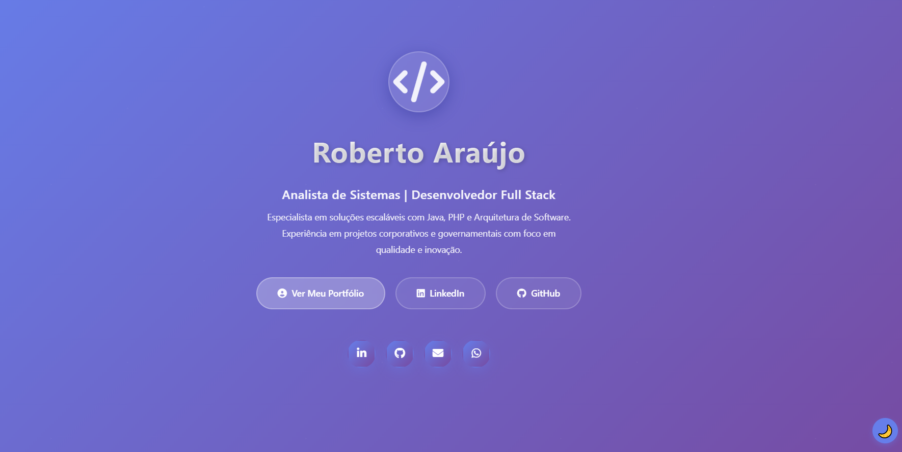

## Roberto Araújo - Portfólio Pessoal



## Tabela de Conteúdos <!-- omit in toc -->

---

## 📋 Tabela de Conteúdos

Template de portfólio moderno e responsivo desenvolvido com tecnologias web padrão (HTML5, CSS3, JavaScript). Otimizado para mobile-first, hospedagem gratuita no GitHub Pages e fácil de customizar para qualquer profissional.

---

## ✨ Sobre o Projeto

Portfólio profissional desenvolvido para apresentar experiência, habilidades e projetos. O site é **completamente responsivo** e otimizado para todas as resoluções de tela, com design moderno e animações fluidas.

* 📱 Design Responsivo (Mobile-First)
* 🎨 Estilos modernos e limpos
* ⚡ Performance otimizada
* 🔧 Fácil de customizar
* 🚀 Deploy automático com GitHub Actions
* 📝 Página de contato com formulário
* 🏠 Hospedagem gratuita no GitHub Pages

---

## 🎯 Funcionalidades

- ✅ **Design Responsivo** - Mobile-first, funciona em qualquer dispositivo
- ✅ **Animações Suaves** - Transições e efeitos visuais modernos
- ✅ **Página de Portfólio** - Experiência, educação e certificações
- ✅ **Formulário de Contato** - Integração com serviços de email
- ✅ **Social Links** - Conexão com LinkedIn, GitHub e redes sociais
- ✅ **Performance Otimizada** - Carregamento rápido e eficiente
- ✅ **SEO Friendly** - Estrutura semântica e meta tags

---

## 🛠️ Tecnologias

1. Clone o repositório
SEU_USUARIO/SEU_REPOSITORIO.git
```

---

```sh
cd SEU_REPOSITORIO
```sh
cd RobertoAraujo.github.io
```

2. **Inicie um servidor local**

Usando Python 3:
```bash
python -m http.server 8000
```

Usando Node.js:
```bash
npx http-server
```

3. **Abra no navegador**
```
http://localhost:8000
```

---

## 📁 Estrutura do Projeto

```
.
├── index.html              # Página inicial
├── portfolio.html          # Portfólio de projetos
├── contact.html            # Formulário de contato
├── .github/
│   └── workflows/
│       └── deploy.yml      # CI/CD automatizado
├── assets/
│   ├── images/             # Imagens
│   ├── icons/              # Ícones SVG
│   ├── fonts/              # Fontes customizadas
│   └── data/               # Dados estáticos
├── css/
│   └── styles.css          # Estilos globais
└── js/
    └── script.js           # JavaScript
```

---

## ✏️ Personalização

### 📝 Editando HTML

#### Editando HTMLEdite nome, bio e informações pessoais
* **portfolio.html** - Adicione seus projetos e trabalhos
* **contact.html** - Personalize formulário de contato
* **index.html** - Personalize seu nome, bio e informações de contato
* **portfolio.html** - Adicione seus projetos e trabalhos

**contact.html** - Contato
- Formulário de mensagens
- Informações de contato

### 🎨 Editando CSS

Modifique [css/styles.css](css/styles.css):

```css
/* Alterar cores principais */
:root {
  --primary: #667eea;
  --secondary: #764ba2;
}

/* Ajustar tipografia */
body {
  font-family: 'Sua Font', sans-serif;
  color: #333;
}

/* Customizar animações */
@keyframes minhaAnimacao {
  from { opacity: 0; }
  to { opacity: 1; }
}
```

### 🔧 Editando JavaScript

Modifique [js/script.js](js/script.js) para:
- Adicionar funcionalidades interativas
- Validar formulários
- Integrar com APIs externas
- Adicionar lógicas customizadas

### 🖼️ Adicionando Imagens

1. Coloque suas imagens em `assets/images/`
2. Referencie no HTML:

```html

```

---

## 🤝 Contribuindo

Melhorias e sugestões são bem-vindas!

1. Faça um **Fork** do projeto
2. Crie uma branch para sua feature (`git checkout -b feature/MinhaFeature`)
3. Commit suas mudanças (`git commit -m 'Add MinhaFeature'`)
4. Push para a branch (`git push origin feature/MinhaFeature`)
5. Abra um **Pull Request**

---

## 📄 Licença

Este projeto está distribuído sob a licença **MIT**. Veja [LICENSE](LICENSE) para mais detalhes.

---

<div align="center">

**Desenvolvido com ❤️ por Roberto Araújo**

[⬆ Voltar ao topo](#roberto-araújo---portfólio-pessoal-)

</div>
